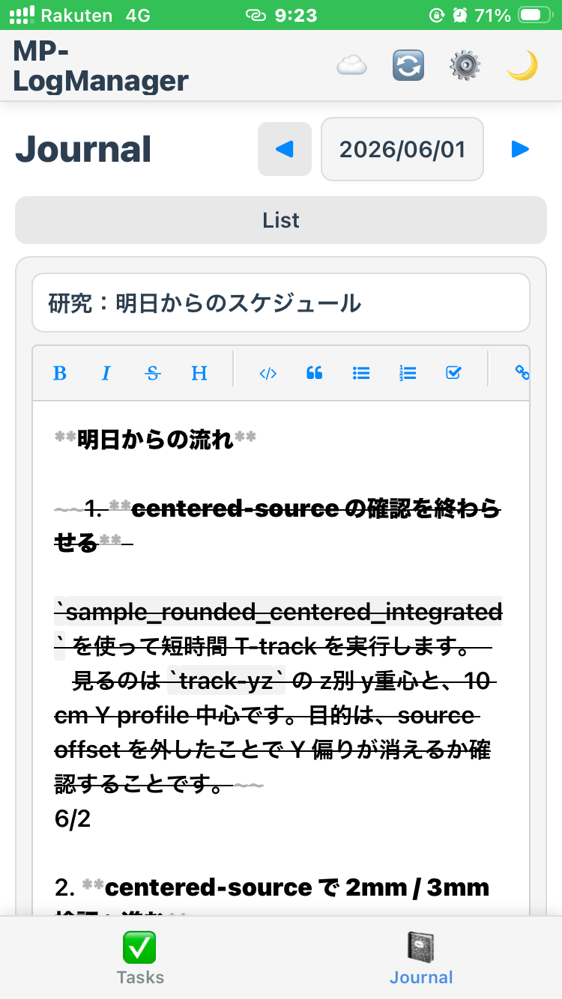
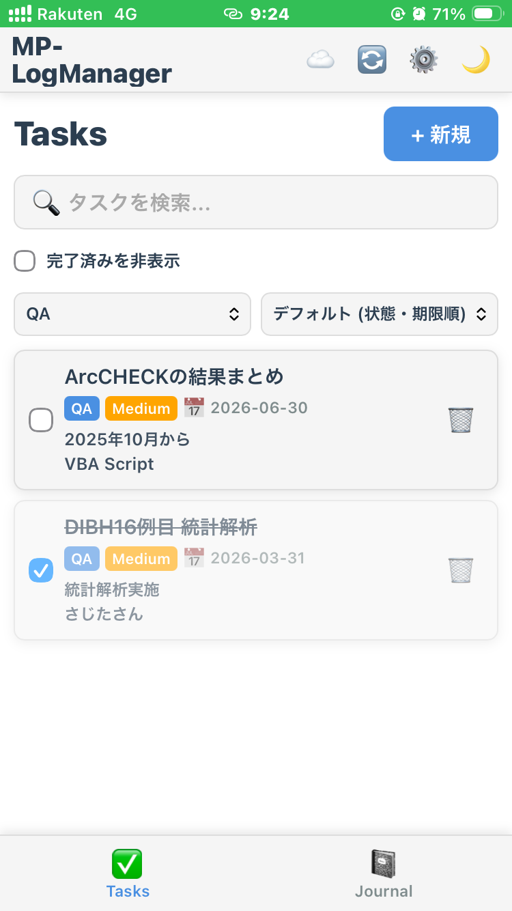

# MP-LogManager (GAS Edition) 🚀

**MP-LogManager (GAS Edition)** は、医学物理士の日常業務をスマートに管理するための、**「究極のプライバシー保護」** を備えたタスク管理・日報アプリケーションです。

---

## 🛡️ 本バージョンの最大の特徴
従来のバージョンとは異なり、**個人のタスクや日報データが GitHub 上に一切保存されません。**

- **データ保存先**: あなたの個人の **Google Drive**
- **Backend (Storage)**: Google Apps Script (GAS)
- **Personal Data**: あなたの個人の **Google Drive** にのみ保存されます。

これらにより、GitHub リポジトリを 公開 (Public) 設定にして GitHub Pages を利用しながらも、**中身のデータは自分だけがアクセスできる安全な場所にある**という、利便性とセキュリティを両立した環境を実現しています。

---

## ✨ 主な機能

| Journal | Tasks |
| --- | --- |
|  |  |

### 📓 Journal (日報・メモ)
- **Rich Editor**: Markdown、シンタックスハイライト、オートセーブ完結。
- **Compact Layout**: PC/iPhone の両方で本文領域を広く使える高密度レイアウト。
- **iPhone Selection**: 長い日報でも、長押しメニューの「すべてを選択」で本文全体を選択可能。
- **PDF出力**: iPhone の AirPrint や PC での PDF 保存に最適化した整形機能。

### ✅ Tasks (タスク管理)
- **Flexible Management**: カテゴリ、優先度、期限によるタスク管理。
- **Markdown Preview**: 広い詳細欄でMarkdownを入力し、「編集」「プレビュー」を切り替えて保存前に表示を確認。
- **Real-time Search**: 全タスクを複数キーワードで検索。
- **Dense Task List**: PC では複数カラム、iPhone では省スペース表示で一覧性を向上。
- **Google Sync (v2.2.5 Optimized)**: Google カレンダーおよび Google Tasks (Todo) との同期機能。**タスク保存時には自動同期されません。設定を ON にしたうえで、ヘッダーの同期ボタンから手動実行してください。** 初回利用時は GAS 側での「承認（手動実行）」が必要です。

---

## 🔧 セットアップ手順（自分専用の構築）

1. **Google Drive 側の準備**
   - **[詳細なセットアップガイドはこちら](docs/SETUP_GUIDE.md)** をご覧ください。
   - **[Google 同期（カレンダー・Todo）の設定はこちら (重要)](docs/GOOGLE_SYNC_SETUP.md)** をご覧ください。
   - GAS 側で `appsscript.json` を編集して Tasks API を有効にする必要があります。
   - **※重要: セットアップ後、GAS エディタで関数を一度「手動実行」して権限を承認 (Authorize) してください。**

2. **Web App への設定**
   - 発行された **GitHub Pages URL** にアクセス。
   - 右上の設定(⚙️)ボタンから、自分専用の **GAS Web App URL** を入力して保存。
   - Google 同期を使う場合は、設定で Calendar / Tasks 同期を ON にしたあと、ヘッダーの同期ボタンで手動同期します。タスク保存だけでは Google 側へ反映されません。

3. **データの復旧・移行**
   - Google Drive 上の JSON ファイルを直接編集することでバックアップや移行が可能です。

---

## 🛠️ 技術スタック
- **Frontend**: Vanilla JS, CSS3 (Modern dark mode), HTML5 (PWA対応)
- **Backend**: Google Apps Script (GAS)
- **Storage**: Google Drive (JSON format)

---

## 📚 ライセンス
MIT License

---
**Developed with Antigravity (Advanced Agentic AI)**
